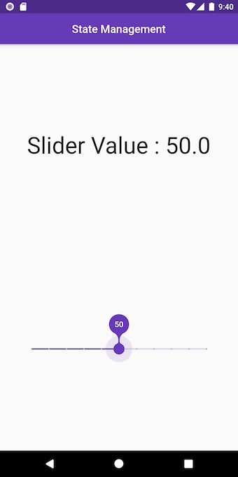

# State Management Provider Example

- This approach is much appreciated in flutter community for updating Widgets states. It is easy to understand and implement



### The Provider Explanation!

- In this, we have made a global model class with 
### The Boring Solution : 

- We stored state of SliderIndicator (whose state we want to change through slider) globally in a variable called "indicatorState", then we could access this stored state's "setState(() {})" method into MySliderState's "onValueChange" function since it("indicatorState") is globally accessible. This led to refreshing the state of SliderIndicator.

**SliderIndicator.dart**
```dart
// Saving State of Widget in Global Instance
_SliderIndicatorState indicatorState;

class SliderIndicator extends StatefulWidget {
  @override
  _SliderIndicatorState createState() {
    indicatorState = _SliderIndicatorState();
    return indicatorState;
  }
}
```

**MySlider.dart**
```dart
  void _onValueChange(double val) {
    setState(() {
      _value = val;
    });
    // Change State of Neighbour Widget = SliderIndicator
    indicatorState.setState(() {
      indicatorState.sliderValue = val;
    });
  }
```

- Also Note that we have made state variables of SliderIndicator _non-private_!

- Feel Free to clone this repo and test code. I have kept it fairly simple to understand for beginners.

## Google I/O 19 - Pragramatic State Management

Inspired from : [youtube link](https://youtu.be/d_m5csmrf7I)

